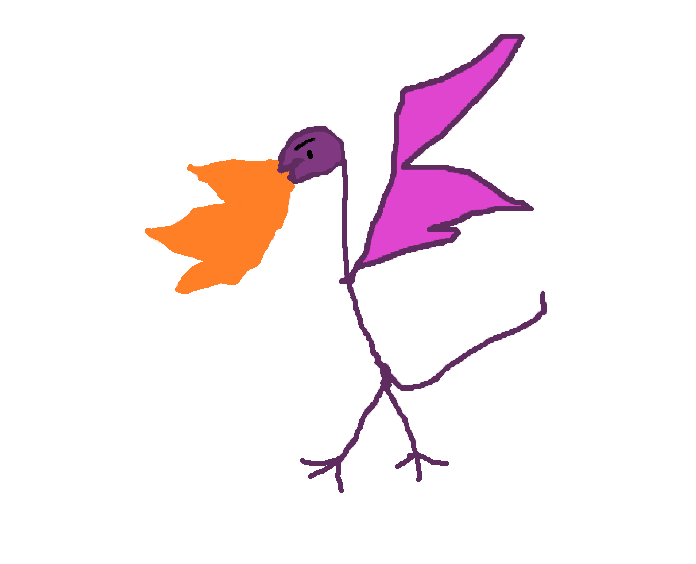

<h1>
F35 BADGE
</h1>

~A User Guide~

-----

A Lockheed Martin Aeronautics Cyber Range (ACR) project. 
Join us on <a href="https://discord.gg/PAeSnwXgJZ">discord</a>  

> Disclaimer
>> [!NOTE]
>> Everything about this badge was made using open-source and public information.
>>
>> The protocols were invented specifically for this badge, despite concepts being based on real protocols.
>>
>> This badge is for fun and educational purposes :smile:
-----
<h2>
Overall Badge Purpose
</h2>

<h4>
 ACCESS EVERYWHERE Current Gen Badge Dominace and take-out the opposition using the latest in BLE and IR smart weapons!
</h4>

## Introduction

Welcome to your DEFCON 33 F-35 Badge! This electronic badge is designed to mimic the systems of an F-35 fighter jet and allows you to interact with other badge holders through a simulated combat system. This guide will walk you through the features and controls of your badge.

## Hardware Overview

Your badge features:
- A color display showing various screens and information
- Two side buttons (left and right)
- A rotary encoder (dial) that can be turned and pressed
- RGB LEDs around the perimeter
- A front-facing LED
- IR transmitter and receiver for "combat"
- Bluetooth for badge-to-badge communication
- WiFi connectivity for updates

## Controls

- **Left/Right Buttons**: Navigate through menus and activate functions
- **Rotary Encoder**: 
  - **Turn**: Scroll through options (acts as up/down)
  - **Press**: Select the current option
- **Button Combinations**:
  - **Left + Right (held together)**: Check for updates

## Main Screen

The main screen is divided into two sections:
- **Left Side**: Shows your badge status
  - Callsign
  - Ownship ID (your badge's unique identifier)
  - Team code (if set)
  - Kills/Deaths score
  - WiFi status
  - Software version

- **Right Side**: Shows nearby badges
  - Lists other badges in range
  - Shows callsigns when available
  - Green text indicates teammates
  - Red text indicates potential targets

## Navigation

From the main screen:
- **Turn Encoder Up**: Access Settings menu
- **Press Encoder**: Enter Lethal Interrogate mode (targeting)
- **Turn Encoder Down**: View Team screen
- **Left Button**: Access Countermeasures (when under attack)
- **Right Button**: Access PHM (Prognostic Health Management) screen

## Badge-to-Badge Combat

The badge features an "Identification Friend or Foe" (IFF) system that allows you to target other badges and be targeted.

### Targeting Another Badge

1. From the main screen, press the encoder to enter Lethal Interrogate mode
2. Turn the encoder to select a target from the list of nearby badges
3. Press the encoder to lock onto the target
4. If successful, your badge will display a HUD (Heads-Up Display)
5. Press the encoder again to "fire" at the target using IR
6. If your IR beam hits the target badge, you score a kill

### Being Targeted

When another badge locks onto you:
1. Your badge will sound an alert
2. The front LED will turn red
3. "LETHAL" will flash on your screen
4. You have a limited time to deploy countermeasures

### Death and Respawn

If you are hit:
1. Your badge will enter "DEAD" state
2. Your LEDs will pulse red
3. You cannot target or be targeted while dead
4. After a cooldown period (approximately 20 seconds), you will respawn

## LED Patterns

Your badge features customizable LED patterns around the perimeter. 

The RGB LEDs are arranged in 2 sections: 

| LED    | State | Description |
| :----------: | :----------: | :----------: |
| Front | Green | Targetting another badge, can shoot   |
| Front  | Red  | Lethal State, can be shot    |
| Main   | RGB   | Change Passive setting in Settings     |
| Main    | RED Breathe    | Happens while Dead      |

The LEDs next to the power switch have two functions: 
- Blue LED: Indicates that the badge is charging  
- Red LED: Indicates the badge is powered on 

### Customizing LEDs

In the Settings menu:
1. Select "LEDs"
2. Choose from options:
   - **Brightness**: Adjust LED brightness (0-100%)
   - **Color**: Select from various colors
   - **Pattern**: Choose animation pattern
   - **Speed**: Adjust animation speed

## Settings Menu

Access the Settings menu by turning the encoder up from the main screen.

### Available Settings

- **LEDs**: Customize LED behavior
- **Sound**: Toggle sound effects on/off
- **Callsign**: Set your personal callsign (up to 6 characters)
- **Team**: Set your team code to identify teammates
- **Connectivity**: Configure WiFi settings
- **About**: View badge information

### Navigating Settings

- Turn the encoder to highlight an option
- Press the encoder to select
- Use left button to go back
- In sub-menus, press the encoder to cycle through available options

## Team Functionality

Teams allow you to identify friendly badges and prevent targeting teammates.

### Setting Up a Team

1. Go to Settings → Team
2. Enter a team code (up to 6 characters)
3. Other badges with the same team code will be identified as teammates
4. Teammates appear in green in the nearby badges list
5. You cannot target teammates in Lethal Interrogate mode

### Viewing Teammates

1. Turn the encoder down from the main screen
2. View current team code and nearby teammates
3. Press encoder to edit team code

## WiFi Connectivity

Your badge can connect to WiFi for updates.

### Configuring WiFi

1. Go to Settings → Connectivity → SSID
2. Enter your WiFi SSID
3. Enter your WiFi password
4. The badge will attempt to connect

### Checking for Updates

Press and hold both left and right buttons to check for updates. If an update is available, your badge will download and install it automatically.

### LIVERY
<table>
<tr>
<td width="33%">
Lockheed logo 
</td>
<td width="33%">
ACR Team logo 
</td>
<td width="33%">
The unofficial team logo 
</td>
</tr>

<tr>
<td>

</td>

<td>

</td>
<td>

</td>
</tr>

<tr>
<td width="33%">
Defcon33 Theme slogan 
</td>
</tr>

<td>

</td>

</tr>
</table>

## Credits

- Software design by: risky
- Hardware design by: Nyquist
- 3D design by: Broske
- A Lockheed Martin Aeronautics Cyber Range Project

Enjoy your DEFCON 32 F-35 Badge!